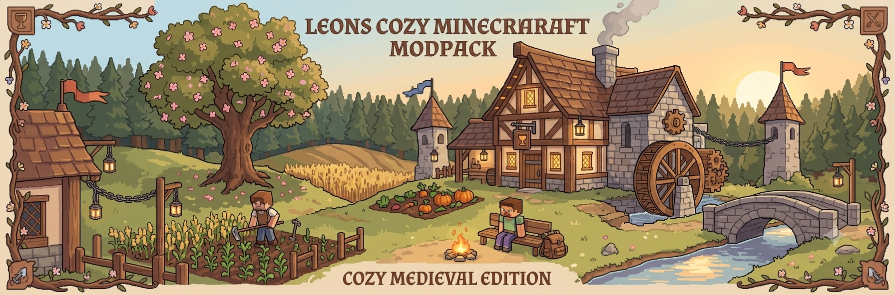

# 🍃 Leons Cozy Minecraft Modpack

Willkommen in der offiziellen Dokumentation und dem Handbuch für **Leons Cozy Minecraft Modpack**! 

Dieses Handbuch ist als übersichtliche, minimalistische Dokumentation aufgebaut, um die Installation, Kompatibilität und Konfiguration aller enthaltenen Mods so einfach wie möglich zu gestalten.

---

### 🎮 Technische Daten

* **Minecraft-Version:** `1.21.11`
* **Mod-Loader:** `Fabric`
* **Empfohlene Launcher:** [Modrinth App](https://modrinth.com/app) | [Prism Launcher](https://prismlauncher.org/)
* **Server-Kompatibilität:** Aternos (Fabric 1.21.11)

---
                                                                                                                                                      

                                                                                                                            

### 📚 Dokumentenübersicht

Klicke auf ein Dokument, um zur entsprechenden Seite zu gelangen:

| Nr. | Dokument | Beschreibung / Inhalt |
| :---: | :--- | :--- |
| **01** | [Einführung & Installation](01_Einfuehrung_und_Installation.md) | Voraussetzungen, Ordnerpfade & Installationsreihenfolge |
| **02** | [Bibliotheken](02_Bibliotheken.md) | APIs und Abhängigkeiten (Dependencies) |
| **03** | [Performance](03_Performance.md) | FPS-Booster, Rendering & Speicher-Optimierung |
| **04** | [Survival & Gameplay](04_Survival_und_Gameplay.md) | Create, Farmer's Delight, Rucksäcke & Spielmechaniken |
| **05** | [Natur & Atmosphäre](05_Natur_und_Atmosphaere.md) | AmbientSounds, Footsteps, Blätter- & Partikeleffekte |
| **06** | [Bauen & Dekoration](06_Bauen_und_Dekoration.md) | Möbel, Deko, Chipped & Supplementaries |
| **07** | [HUD & Quality of Life](07_HUD_und_Quality_of_Life.md) | EMI, Jade, Inventarsortierung & Komfort-Funktionen |
| **08** | [Animationen](08_Animationen.md) | 3D Skins, Ess-Animationen & Egoperspektive |
| **09** | [Resource Packs](09_Resource_Packs.md) | Fresh Animations, Bushy Leaves & Tweaks |
| **10** | [Shader](10_Shader.md) | BSL Shader & Lichteffekte |
| **11** | [Empfohlene Einstellungen](11_Empfohlene_Einstellungen.md) | Optimale Grafikeinstellungen & Tastenbelegungen |
| **12** | [Vollständige Modliste](12_Vollstaendige_Modliste.md) | Gesamte Liste aller Mods mit Downloadlinks |

---

### 🏷️ Legende der Kennzeichnungen

* 🔴 **Host:** Muss zusätzlich auf dem Server (z. B. Aternos) installiert werden.
* 🟢 **Essential:** Muss von jedem Spieler auf dem eigenen PC (Client) installiert werden.
* 📦 **Bibliothek:** Technische Voraussetzung (API/Dependency) für andere Mods.

---

*Erstellt für Leons Cozy Minecraft Modpack.*
